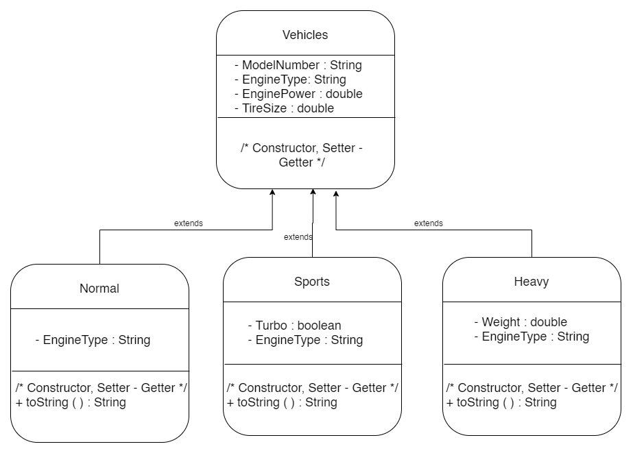

### DSI Assignment Repo (Vehicle Showroom and Login System)
This repository contains two assignment files. In <b> VehicleShowroom </b> folder, vehicle showroom assignment is 
kept which is done using Java and rest of the folder and files are for designing a <em> Login </em> problem using Node.js, Express.Js and Mongodb.  
<b>Tools/Technology </b> : Java (for Showrrom project), Node.Js, Express.Js, MongoDB, HTML, Bootstrap and CSS.

<h6> <a href="https://youtu.be/7jEXiUAvlCg"> Login System Project demo </a> </h6>
<h6> <a href="https://youtu.be/lAE2MZyr-CA"> Vehicles Showroom Project demo </a> </h6>

#### Dependencies
<h5> Login Project </h5>
1. It has been tested in windows 10 machine.  
2. Express  
3. Nodemon  
4. Mongoose  
5. ejs  
6. MongoDB  

<h5> Vehicle Showroom </h5>
1. Tested on Windows 10 machine.  
2. Tested on Eclipse editor.  
3. Java 

#### Running Procedure
<h5>Login System</h5>

<b>Step 1: </b> Create a folder containing any name.  
<b>Step 2: </b> Go inside the folder, open terminal and execute following command to create server. <h5> `npm init -y` </h5> 
<b>Step 3: </b> Intall all the dependencies by executing following command. <h5> `npm i express mongoose ejs` </h5>
Note  : Express is our server, mongoose will be required for database and ejs for different views.  
<b>Step 4: </b> Install nodemon by executing following command for automaticaaly refresh the server. <h5> `npm i --save-dev nodemon` </h5>
<b>Step 5: </b> Go inside the <em>package.json </em> file and change the test inside the scripts to <em> "start" : "nodemon server.js" </em>  
<b>Step 6: </b> Download the this repository and extracted the files.  
<b>Step 7: </b> Copy the <b> models, views, routes and server files </b> from extracted repository to your project repository  
<b>Step 8: </b> Download the mongodb from the following link. <h5>`https://www.mongodb.com/try/download/community` </h5>
<b>Step 9: </b> Install the mongodb to your local computer. Also install mongodb compass.  
<b>Step 10: </b> After installing mongodb go to `cdrive->program files->mongodb->server->4.2(any version)->bin` folder. Open terminal and execute `mongod` command to start mongodb.  
<b>Step 11: </b> Run MongoDB Compass. 
<b>Step 12: </b> Run `npm start` command in terminal. It will start your project.  
<b>Step 13: </b> Got to your web browser and type `localhost:5000`. The project will be visualized. 
<b>Step 14: </b> First signup into a account and then login with this accout. 

<h5> Vehicle Showroom </h5>

<b>Step 1: </b> Open a Java editor. Eclipse preferable.  
<b>Step 2: </b> Create a java project. 
<b>Step 3: </b> Under the project create class named `Vehicles, Normal, Sports, Heavy, Main` and copy the extracted corresponsing files values from <b>VehicleShowrrom</b> folder.  
<b>Step 4: </b> Run the main class. 

<h5> UML Diagram </h5>

